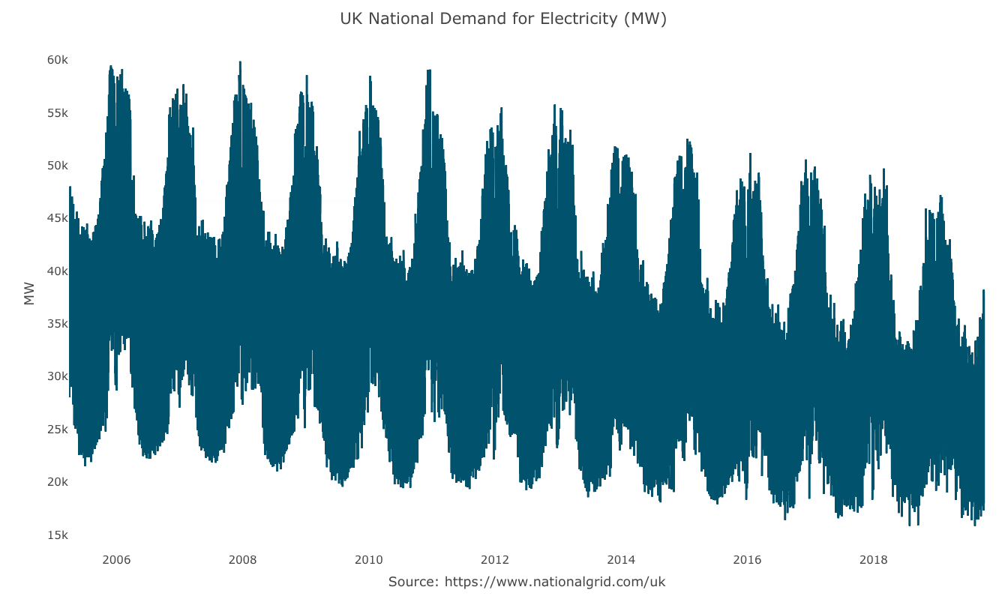

UKgrid
======

<!-- badges: start -->
[](https://www.tidyverse.org/lifecycle/#maturing)
[](https://cran.r-project.org/package=UKgrid)
[](https://opensource.org/licenses/MIT)
<!-- badges: end -->


An R data package with the UK [National Grid](https://en.wikipedia.org/wiki/National_Grid_(Great_Britain)) historical demand for electricity between April 2005 and October 2019


Overview
--------
The UKgrid dataset is an example of a multiple seasonality time series. This time series captures the demand for electricity and its components in the UK since April 2005 using half-hour intervals. In addition, the package provides a function to extract, subset and aggregate the series into `tsibble`, `ts`, `xts`, `zoo`, `data.frame`, `data.table`, or `tbl`. 

The data was sourced from the National Grid UK [website](https://www.nationalgrid.com/uk)




Installation
------------

Install the stable version from [CRAN](https://CRAN.R-project.org/package=UKgrid):

``` r
install.packages("UKgrid")
```

or install the development version from [Github](https://github.com/RamiKrispin/UKgrid):

``` r
# install.packages("remotes")
remotes::install_github("RamiKrispin/UKgrid")
```


Usage
-----

``` r
library(UKgrid)

# Load the full dataset (data.frame format)
data("UKgrid")

# Extract only the demand field (ND - National Demand) using tsibble format
extract_grid(type = "tsibble", 
             columns = "ND") 

# Extract the demand between 2016 and 2017 using tbl format
extract_grid(type = "tbl", 
             columns = "ND", 
             start = 2016, 
             end = 2017)

# Extract the first 10 days in 2018 and aggregate to hourly using zoo format
extract_grid(type = "zoo", 
             columns = "ND", 
             start = as.Date("2018-01-01"), 
             end = as.Date("2018-01-10"),
             aggregate = "hourly")
``` 

More details available on the package [site](https://ramikrispin.github.io/UKgrid/) and [vignette](https://ramikrispin.github.io/UKgrid/articles/UKgrid_vignette.html)
